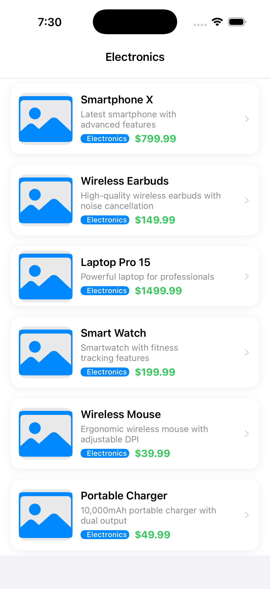
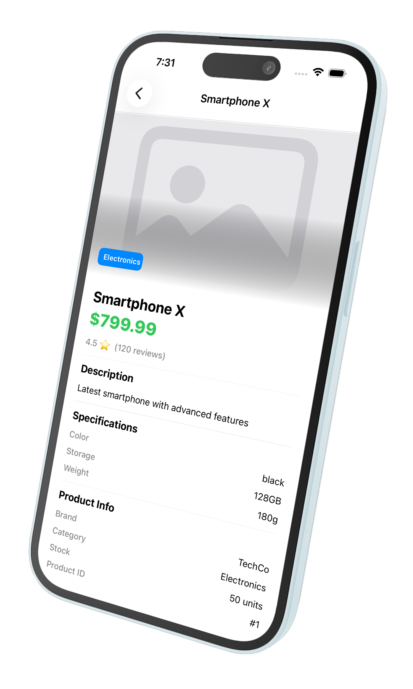
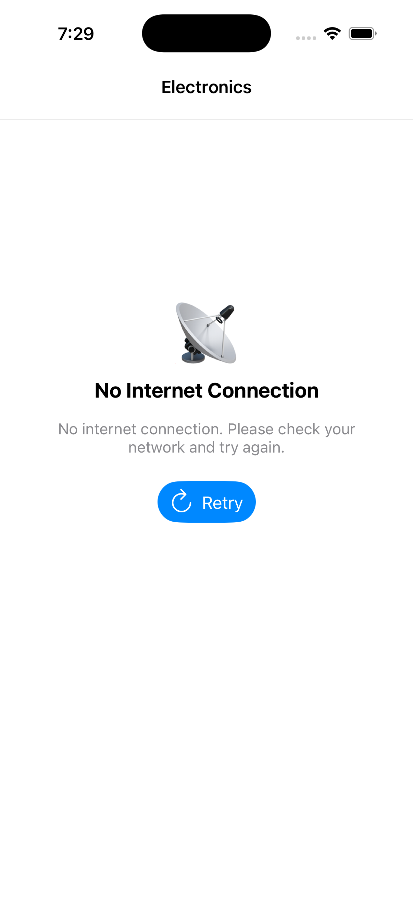
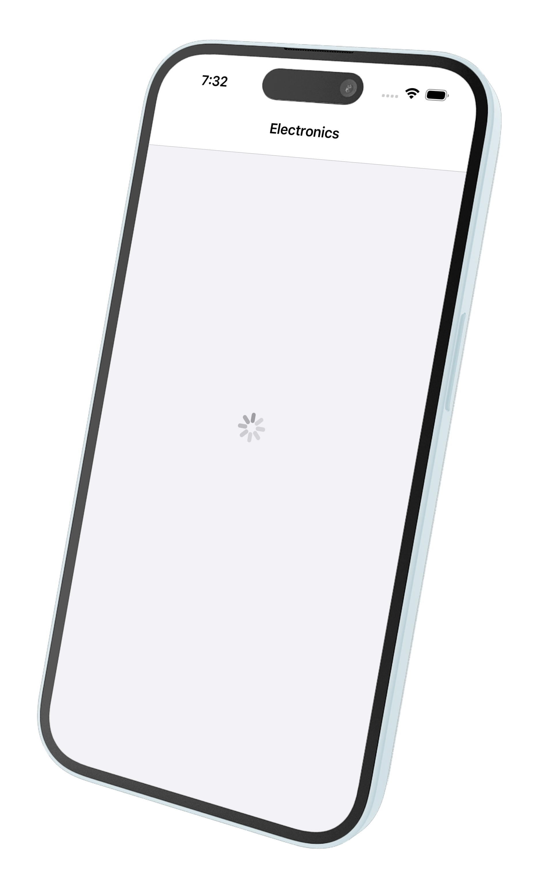
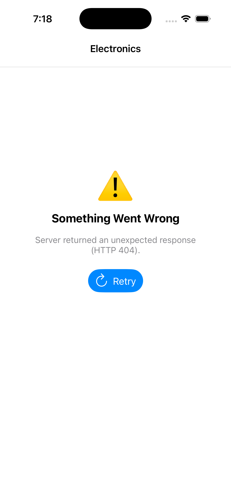
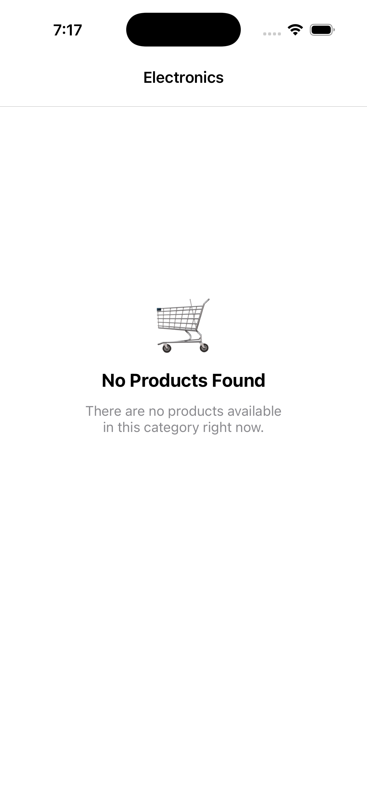

<h1>ProductsApp</h1>
A paginated UIKit app that fetches electronics from a REST API and displays them in a UITableView. Built with MVVM, clean networking via URLSession + Codable, and lazy image loading — all in pure UIKit, zero third-party dependencies.

<h2>Screens</h2>

<table>
  <tr>
    <td align="center">
      
    </td>
    <td align="center">
      
    </td>
  </tr>

  <tr>
    <td align="center"><b>Products List</b></td>
    <td align="center"><b>Product Details</b></td>
  </tr>
</table>

<h2>States</h2>

<table>
  <tr>
    <td align="center">
      
    </td>
    <td align="center">
      
    </td>
    <td align="center">
      
    </td>
    <td align="center">
      
    </td>
  </tr>

  <tr>
    <td align="center"><b>No Internet</b></td>
    <td align="center"><b>Loading State</b></td>
    <td align="center"><b>API Error</b></td>
    <td align="center"><b>No Data</b></td>
  </tr>
</table>

<h3>Note</h3>
To trigger the "No Internet", "API Error" and "No Data" states, a MockNetworkService has been created. Please refer to comments present in the "SceneDelegate" file to inject the MockNetworkService correctly.
